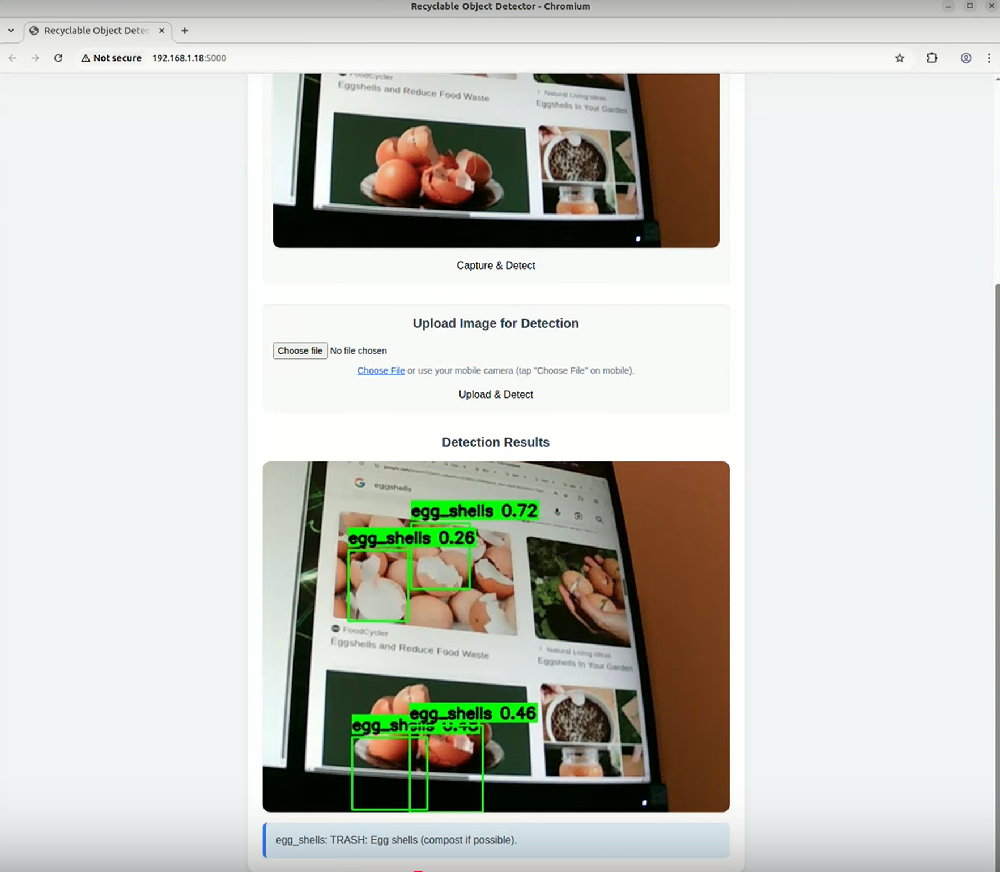

# **My YOLOv5 Application: app.py**

Welcome to this fork, which documents a practical application built upon the powerful YOLOv5 framework. This project focuses on a waste sorting web application, leveraging YOLOv5's object detection capabilities. Below, you'll find a summary of the core YOLOv5 components that app.py utilizes, providing essential context for its functionality.
Watch the demonstration: https://www.youtube.com/watch?v=w0kHhLwCxLQ

## **Background**
As a college student living on campus, I often find myself unable to determine whether certain waste, like the tons of different types of plastics, can be put into the recycling bin. Therefore, I sought to fix this problem for myself. Initially, my idea was to construct an automatic recycling machine, complete with a mechanical arm, to sort my trash and recyclables. This led me to consider leveraging YOLOv5's object detection capabilities to identify different types of waste. However, I soon realized that building such a complex mechatronic system was beyond my current experience. Consequently, I shifted focus to a more feasible approach: developing a locally hosted web application.   
Given my background in web design, this solution seemed more achievable and offered the added benefit of mobile accessibility, allowing users to simply upload an image from their phones. For the image data, I sourced nearly 1500 images, about 50 per class, from Alistair King's "Recyclable and Household Waste Classification" dataset on Kaggle. I then used Roboflow to label these images, splitting them into approximately 80% for training, 10% for validation, and 10% for testing, also employing active learning to efficiently label unsorted images. Despite using active learning, I still ended up manually labeling almost all 1500 images myself; in hindsight, I would have reduced the number of classes and focused on a smaller subset, and for future labeling tasks, I'd definitely work in a team as Roboflow allows. The resulting YOLOv5 model performed decently, but optimizing it for GPU inference proved challenging as I was unable to find compatible PyTorch wheels or Docker images for the newest Jetson Orin Nano JetPack 6.0 GA R36.4.3 Python 3.10 cuDNN 9.3 (as of writing), forcing me to optimize solely for CPU using ONNX. With the model ready, I developed the web application using Python, Flask, and HTML.   
The final product is a inituitive, user-friendly web application running on a low-power Jetson Orin Nano capable of identifying waste types and providing proper disposal instructions. Interestingly, the model excels at detecting aerosol cans, because that is the first class alphabetically in my dataset and as a result was always the first thing I labelled, hence when I had to most energy and motivation to do so.

## **Workflow**

Here's a step-by-step guide to replicate the waste sorting web application, focusing on utilizing my already trained and optimized model.

### **1\. Environment Setup**

First, create and activate a virtual environment to manage your project's dependencies cleanly.  
\# Create a virtual environment  
python \-m venv yolov5\_venv

\# Activate the virtual environment  
\# On Windows:  
.\\yolov5\_venv\\Scripts\\activate  
\# On macOS/Linux:  
source yolov5\_venv/bin/activate

\# Clone the YOLOv5 repository  
git clone https://github.com/ultralytics/yolov5.git  
cd yolov5

\# Install the core YOLOv5 requirements  
python \-m pip install \-r requirements.txt

\# Install dependencies for ONNX inference and the Flask web application  
python \-m pip install onnxruntime-gpu \# Use onnxruntime-gpu if you have a compatible GPU, otherwise onnxruntime  
python \-m pip install Flask Pillow \# Flask for the web app, Pillow for image processing

### **2\. Acquire Trained Model**

To replicate my work, you'll need access to my trained YOLOv5 model. Assuming you have been provided with the best.onnx file (or the best.pt file from which you can export to ONNX), place it in a convenient location within your yolov5 directory, for example, directly in the yolov5/runs/train/waste\_detector11/weights/ folder.  
*(For context, my original training command used on a Jetson Orin Nano was:*  
python train.py \--img 256 \--batch 8 \--epochs 100 \--data my\_waste\_dataset\_yolov5/data.yaml \--weights yolov5s.pt \--name waste\_detector 

(After training, I made sure my model was working with python detect.py \--weights runs/train/waste\_detector11/weights/best.pt \--source 0 \--conf 0.25. (11 because I guess I kept using the same name to train and the first 10 times were unsuccessful). I exported the model to ONNX for CPU optimization only due to compatibility issues with PyTorch Jetson Orin Nano JetPack 6.0 GA R36.4.3 Python 3.10 cuDNN 9.3 for GPU optimization. I was unable to find compatible PyTorch wheels and Docker images for my particular Jetpack and L4T version, with this forum conferring my claim: [https://forums.developer.nvidia.com/t/jetpack-6-0-missing-pytorch-cuda-support-for-jetson-inference-need-official-wheel-or-build-instructions/332512/15](https://forums.developer.nvidia.com/t/jetpack-6-0-missing-pytorch-cuda-support-for-jetson-inference-need-official-wheel-or-build-instructions/332512/15))

*I then exported the model to ONNX for CPU optimization only, due to the aforementioned compatibility issues with PyTorch on the Jetson's specific software stack. The command I used for export was:*  
python export.py \--weights runs/train/waste\_detector11/weights/best.pt \--include onnx \--imgsz 640 \--simplify \--device cpu

*I then tested it using python detect.py \--weights runs/train/waste\_detector11/weights/best.onnx \--source 0 \--conf 0.25 \#This ran great, it felt smoother and faster than the .pt. Now I was ready to set up my app.py*

*With the ONNX model confirmed to be working well, I proceeded to set up the app.py web application.)*

### **3\. Web Application Setup and Run**

Create your app.py file. For simplicity and to leverage YOLOv5's utility functions directly, it is recommended to place app.py in the root directory of your cloned yolov5 repository (e.g., yolov5/app.py). The Flask web framework, by default, looks for HTML templates in a templates folder, so your web page should be placed inside yolov5/templates/index.html. Once both are done, run: **python app.py**

### **4\. Usage**

Once the web application is running:

* Open the web application in your browser (or phone browser).  
* Use the "Choose File" button to select an image of a waste item.  
* Click "Upload and Predict" to send the image to the server.  
* Else, a live feed should appear and you may select “Capture and Detect”  
* The application will display the detected waste type, its confidence, and the proper disposal instructions.

## **Understanding YOLOv5 Core Components (for my own reference)**

### **train.py**

train.py is the central script for orchestrating the YOLOv5 model training process. It leverages PyTorch for defining the training loop, managing optimizers (like SGD or Adam), and scheduling learning rates. This script handles data loading through PyTorch DataLoaders, performs forward and backward passes, and updates model weights using PyTorch's autograd engine. It also integrates PyTorch's DistributedDataParallel for efficient multi-GPU training. Ultimately, train.py saves and loads PyTorch model checkpoints (.pt files) to resume or store training progress.

### **models/yolo.py**

models/yolo.py defines the core architecture of the YOLOv5 detection model. It constructs the neural network using PyTorch's torch.nn modules, such as Conv2d, BatchNorm2d, and custom layers. This file specifies how different layers are connected to form the backbone, neck, and head of the YOLOv5 model. The Model class within this file inherits from torch.nn.Module, making it a standard PyTorch model that can be trained and inferred upon. It also handles the integration of anchor boxes for object detection.

### **utils/dataloaders.py**

utils/dataloaders.py is responsible for efficiently loading and preprocessing image and label data for training and validation. It implements custom PyTorch Dataset classes to handle various data formats and augmentations like mosaic and mixup. These datasets are then wrapped by PyTorch DataLoader objects, which manage batching, shuffling, and multi-worker data loading. This PyTorch-native approach ensures that data is fed to the model efficiently on the specified device (CPU/GPU) during training.

### **utils/loss.py**

utils/loss.py (likely utils/loss.py given common YOLOv5 structure) defines the composite loss function used to train the YOLOv5 model. This loss function combines components like bounding box regression loss, objectness loss, and classification loss. All loss calculations are performed using PyTorch tensor operations, ensuring they are differentiable and compatible with PyTorch's autograd system. The ComputeLoss class efficiently calculates these losses for the model's predictions and ground truth targets, guiding the optimization process.

### **detect.py**

detect.py is the script dedicated to performing inference on images or videos using a trained YOLOv5 model. It loads a PyTorch model checkpoint (.pt file) onto the specified device (CPU or GPU). The script then feeds input data through the loaded PyTorch model's forward pass to obtain predictions. Post-processing steps, suchs as non-maximum suppression (NMS), are applied to these raw PyTorch tensor outputs to yield final bounding box detections.

### **val.py**

val.py is used for evaluating the performance of a trained YOLOv5 model on a validation dataset. It loads a PyTorch model and utilizes PyTorch DataLoaders to efficiently process validation batches. During evaluation, the script performs a forward pass on the validation images using the PyTorch model to get predictions. It then computes various metrics, such as Precision, Recall, and mean Average Precision (mAP), all based on the PyTorch tensor outputs, providing a comprehensive assessment of the model's accuracy.  
